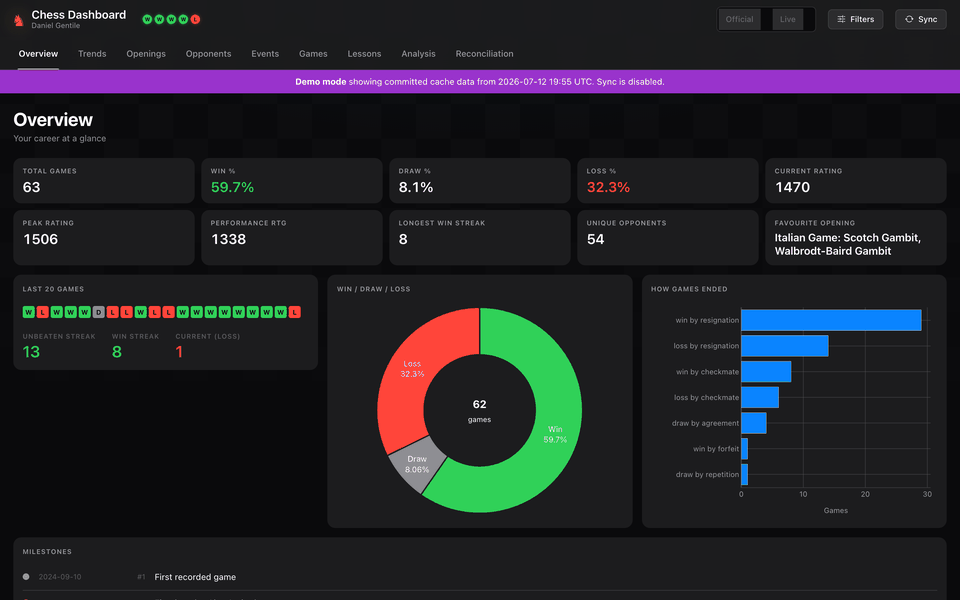
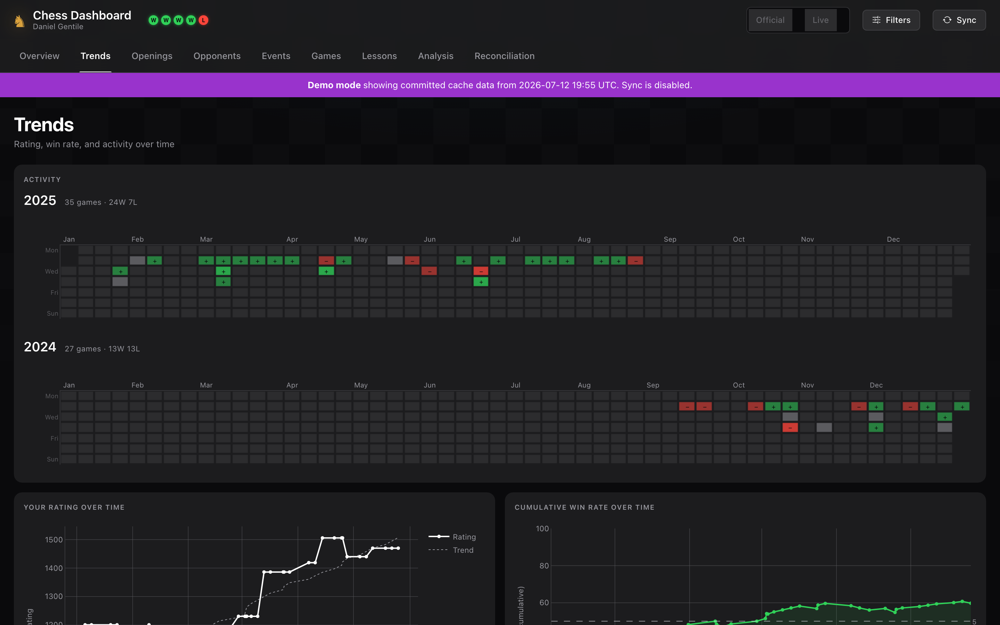
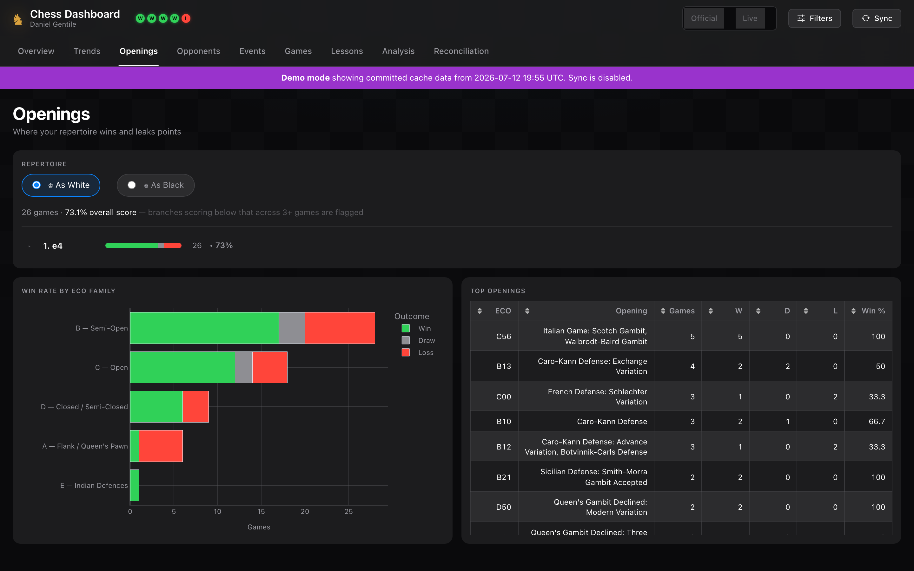
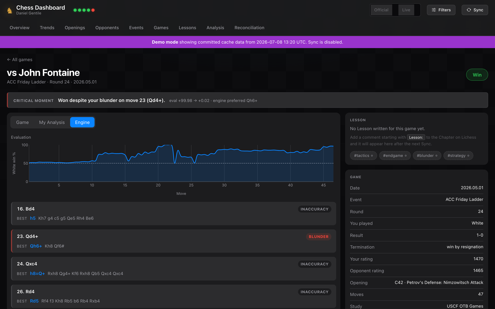
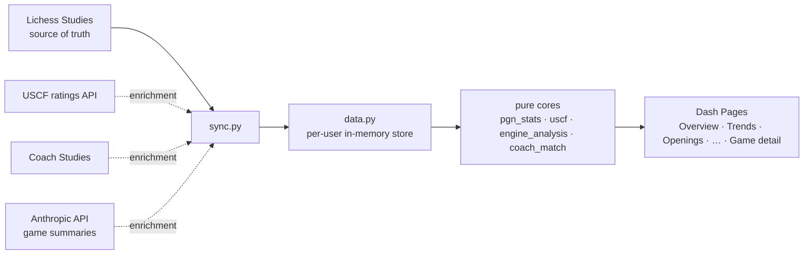

# Chess Dashboard

[](https://github.com/danielgentile22/chess-dashboard/actions/workflows/ci.yml)
[](LICENSE)

**As a tournament chess player, your results live in two systems that don't talk to each other — and disagree.** Your games and your own analysis are in Lichess Studies; your official record — ratings, crosstables, event results — is on USCF's site, and neither knows about the other. Chess Dashboard syncs your games from the Lichess API, enriches them with your official USCF data, engine analysis, AI summaries, and your coach's reviews, and surfaces every place the two sources disagree instead of silently picking one. It comes out as a dark-themed, fully filterable Plotly Dash app. No database, no manual exports.



**Try it in one command** — no account, no config, seeded with a real (anonymized) tournament history:

```bash
git clone https://github.com/danielgentile22/chess-dashboard.git && cd chess-dashboard
make demo        # → http://localhost:8050
```

Why it's technically interesting:

- **Two unreliable sources, one honest view** — Lichess Studies are the source of truth; the undocumented USCF ratings API is enrichment that can never fail a sync. A matching engine pairs every game with its official USCF record (by member ID, then fuzzy name+date), and every disagreement between the sources lands on a Reconciliation page instead of being silently "corrected".
- **Enrichment pipeline** — engine evals, error profiles, auto-derived weakness tags, Anthropic-generated plain-English game summaries, and coach-review chapters (matched to games *by the moves played*) all attach to games as optional layers; any layer being unavailable degrades gracefully.
- **Multi-user with per-user isolation** — an opt-in login gate turns the same codebase into a coach/student deployment, each user seeing only their own store (`docs/decisions/0005`).
- **Deliberate architecture** — pure, framework-agnostic core modules with mirrored HTTP-client boundaries, ~20 test modules covering them, seven [ADRs](docs/decisions/) recording the load-bearing decisions, CI on every push, deployed on Fly.io.

| | |
|---|---|
|  |  |
|  |  |

---

## Architecture at a glance



Every external service has exactly one client module that talks HTTP to it; everything computed is a pure function from DataFrames to data, testable without Dash. The seven decisions that shape all of this are written down as [ADRs](docs/decisions/) — start with [0001: Lichess Studies are the source of truth](docs/decisions/0001-lichess-studies-are-the-source-of-truth.md).

---

## Features

Ten pages, plus one global filter drawer that slices every chart on every page at once and survives navigation. The full walkthrough is in **[docs/features.md](docs/features.md)**; the shape of it:

| Page | What you get |
|---|---|
| **Overview** | KPIs, USCF profile card (Official vs Live side by side), streaks, W/D/L, milestone timeline, your top recurring weakness |
| **Trends** | activity calendar, dual-line rating chart, win-rate trends, results by time control, the fatigue check, upset tracker |
| **Openings** | your repertoire tree with point-leaking branches flagged, plus ECO-family breakdown |
| **Opponents** | a Scouting Report per opponent — USCF identity, then-vs-now ratings, your record, their openings against you |
| **Events** | Series → Rated Events, each with your final placement and the full crosstable |
| **Games** | every game with its USCF match status (✓ by ID · ≈ by name · ⚠ conflict · Forfeit) |
| **Lessons** | your `Lesson:` notes, recurring-weakness callouts, and a pre-game review mode |
| **Analysis** | your tactical-vs-positional error profile from Lichess's engine analysis |
| **Reconciliation** | every Studies↔USCF disagreement, grouped and actionable |

Three things worth calling out:

- **The Official/Live rating lens** — a header toggle that changes what *"your rating"* means across every rating-derived number, without hiding a single game.
- **Game detail** — an interactive board (Lichess's open-source pgn-viewer, bundled locally, not an iframe) behind up to four views — Game / My Analysis / Engine / Coach — each shown only when it has content.
- **Graceful degradation everywhere** — USCF unreachable, no engine analysis, no AI key, coach study down: every enrichment layer falls back to cached-or-absent and never fails a Sync (ADRs [0003](docs/decisions/0003-uscf-is-enrichment-never-a-dependency.md) / [0004](docs/decisions/0004-engine-analysis-is-enrichment-never-a-dependency.md)).

---

## Quick Start

### Demo mode (no setup)

```bash
make demo            # or: python app.py --demo
```

Boots entirely from a committed, anonymized game history (`tests/data/demo-games.pgn`) — no Lichess account, no API calls, no configuration — so you can explore every page with a real (anonymized) tournament history. `DEMO_MODE=1 docker compose up --build` does the same in Docker.

### Prerequisites

- Python 3.10 or newer
- A Lichess Study containing your games (one Game per Chapter), e.g. `https://lichess.org/study/abcdWXYZ` → study ID `abcdWXYZ`

### Install with Make (recommended)

```bash
git clone https://github.com/danielgentile22/chess-dashboard.git
cd chess-dashboard
make install        # creates .venv and installs runtime deps
make run STUDY=abcdWXYZ
```

Then open [http://localhost:8050](http://localhost:8050).

### Install manually

```bash
git clone https://github.com/danielgentile22/chess-dashboard.git
cd chess-dashboard
python3 -m venv .venv
source .venv/bin/activate      # Windows: .venv\Scripts\activate
pip install -r requirements.txt
python app.py --study abcdWXYZ
```

### CLI options

| Flag | Default | Description |
|---|---|---|
| `--study` | `$LICHESS_STUDY_IDS` | Lichess study ID to Sync games from (repeat for multiple Studies) |
| `--player` | auto-detected | Your name as it appears in Game headers |
| `--token` | `$LICHESS_API_TOKEN` | Lichess API token (only for private studies) |
| `--cache` | `games.pgn` | PGN cache of the last successful Sync, used as offline fallback |
| `--uscf-member` | `$USCF_MEMBER_ID` | USCF member ID whose record enriches the Games (omit to run Lichess-only) |
| `--uscf-cache` | `uscf_cache.json` | USCF response cache for offline fallback |
| `--analysis-cache` | `analysis_cache.json` | AI-summary cache so unchanged Games aren't re-billed |
| `--host` | `127.0.0.1` | Host to bind to |
| `--port` | `8050` | Port to listen on |
| `--debug` | off | Enable Dash hot-reload mode |

When your archive grows past Lichess's 64-chapter Study limit, designate the next Study too:

```bash
python app.py --study abcdWXYZ --study abcd1234
```

Games from all designated Studies are merged, deduplicated by chapter, and sorted by date.

If your name isn't auto-detected, pass it explicitly:

```bash
python app.py --study abcdWXYZ --player "Last, First"
```

### Environment variables

| Variable | Description |
|---|---|
| `LICHESS_STUDY_IDS` | Comma-separated Lichess study IDs to Sync from (e.g. `abcdWXYZ,abcd1234`) |
| `LICHESS_API_TOKEN` | Optional API token, only needed if a Study is private |
| `PLAYER_NAME` | Override player-name auto-detection |
| `CACHE_PATH` | PGN cache of the last successful Sync, used as offline fallback (default: `games.pgn`) |
| `USCF_MEMBER_ID` | USCF member ID whose record enriches the Games (unset → Lichess-only) |
| `USCF_CACHE_PATH` | USCF response cache, used as fallback when USCF is unreachable (default: `uscf_cache.json`) |
| `ANTHROPIC_API_KEY` | Optional Anthropic key for the plain-English AI game summaries; unset → the summary step is a no-op and the dashboard runs unchanged |
| `ANALYSIS_CACHE_PATH` | AI-summary cache so unchanged Games aren't re-billed (default: `analysis_cache.json`) |
| `USCF_DASHBOARD_USERS` | JSON array of user records to enable multi-user login + coach review (PRD #55); empty → single-user, ungated. See *Multi-user access & coach review* above |
| `SECRET_KEY` | Signs the login session cookie; **must** be a stable secret in any multi-user deployment |
| `DATA_DIR` | Where each user's disposable caches live, one subdir per user (default: `.user-data`) |
| `HOST` / `PORT` / `DEBUG` | Server binding and debug mode |

### Offline resilience

Every successful Sync writes a local PGN cache. If Lichess is unreachable when the app starts, it boots from that cache and shows a "cached data" notice; if a Sync from the header button fails, the data you're looking at stays untouched and an error toast appears. The cache is disposable — the designated Studies on Lichess remain the only source of truth.

USCF gets the same treatment (`uscf_cache.json`): when the USCF API is unreachable, USCF surfaces show the last successful Sync's data with an "unavailable since" warning — and the Sync itself still succeeds.

The plain-English AI game summaries follow the same contract (`analysis_cache.json`): each is cached by Game identity so an unchanged Game is never re-billed, and if the summary step is unavailable (no key, or the API is down) the Sync still succeeds — the summary just doesn't appear.

---

## Developer Workflow

All common tasks are wrapped in the `Makefile`:

```bash
make help           # list all targets
make install-dev    # install runtime + dev deps (pytest, ruff, mypy)
make test           # run pytest with coverage report
make lint           # run ruff (auto-fix)
make typecheck      # run mypy on the core + client modules
make run-debug      # start with hot-reload
make docker-up      # build & run in Docker
```

---

## Running with Docker

```bash
# Build and run
docker compose up --build

# Or just build the image
docker build -t chess-dashboard .
docker run -p 8050:8050 -e LICHESS_STUDY_IDS="abcdWXYZ" chess-dashboard
```

---

## Deployment on Fly.io

The included `fly.toml` deploys the dashboard to [Fly.io](https://fly.io) as a single small machine (shared CPU, 512 MB) with a persistent volume for the caches:

```bash
fly launch --copy-config   # first time — creates the app and the volume
fly deploy                 # every time after
```

Points worth knowing:

- Set your own values in `[env]` (`LICHESS_STUDY_IDS`, `USCF_MEMBER_ID`, …); put secrets (`LICHESS_API_TOKEN`, `ANTHROPIC_API_KEY`, `SECRET_KEY`, `USCF_DASHBOARD_USERS`) in `fly secrets set` instead of the file.
- The cache paths (`CACHE_PATH`, `USCF_CACHE_PATH`, `ANALYSIS_CACHE_PATH`, `DATA_DIR`) point at the mounted volume so caches survive deploys. They're disposable either way — losing them just means the next Sync re-fetches.
- Fly health-checks `GET /health`, which the app serves.

The container runs `gunicorn app:server --config gunicorn.conf.py`, so any platform that can run the Dockerfile works the same way.

### Hosting a public demo

A read-only public demo is just a second Fly app running demo mode — no secrets, no volume needed:

```bash
fly launch --copy-config --name chess-dashboard-demo --no-deploy
fly secrets set -a chess-dashboard-demo DEMO_MODE=1
fly deploy -a chess-dashboard-demo
```

Demo mode makes no network calls and never writes, so the smallest machine works.

---

## Game / PGN Compatibility

Games are read from Lichess Study chapters (which Lichess serves as standard PGN). Any chapter that includes the headers below works:

| Header | Required? | Notes |
|---|---|---|
| `White` / `Black` | Yes | Used to identify you and your opponents |
| `Result` | Yes | `1-0`, `0-1`, or `1/2-1/2` |
| `Date` | Recommended | Enables timeline charts; format `YYYY.MM.DD` |
| `WhiteElo` / `BlackElo` | Optional | Rating progression and opponent strength charts |
| `Event` | Optional | Tournament performance section |
| `ECO` / `Opening` | Optional | Opening analysis section |
| `Termination` | Optional | Termination breakdown chart |
| `TimeControl` | Optional | Results-by-time-control chart (`110+10`, `40/80, SD30; +30`, `G/30;d5`, …) |
| `Round` | Optional | Score-by-round fatigue chart |

---

## Project Structure

```
chess-dashboard/
├── app.py                   # Entry point — Dash factory (use_pages), CLI, gunicorn server
├── config.py                # Environment variable config (LICHESS_STUDY_IDS, USCF_MEMBER_ID, …)
├── data.py                  # Per-user store registry (Synced from Lichess + USCF; ADR 0005)
├── sync.py                  # Sync orchestrator: Studies → merged Games, USCF → enrichment
├── lichess_client.py        # Lichess API client (the only module that talks HTTP to Lichess)
├── uscf_client.py           # USCF ratings API client (the only module that talks HTTP to USCF)
├── uscf_core.py             # Pure USCF interpretation: profile, rating series, matching engine, reconciliation
├── auth.py                  # Login gate (multi-user mode): session cookie, per-request user activation
├── user_config.py           # USCF_DASHBOARD_USERS parsing + the `python -m user_config hash` helper
├── coach_match_core.py      # Pure coach-review matching: coach Chapters → Games, by the moves played
├── shell.py                 # Persistent app chrome: header, nav tabs, sync machinery
├── filters.py               # Global filter drawer + shared FILTER_INPUTS
├── components.py            # Shared UI building blocks (cards, KPI tiles, form dots, …)
├── styles.py                # Color palette, dark-theme helpers, empty_fig()
├── pgn_stats_core.py        # PGN parsing, statistics, and insights functions
├── engine_analysis_core.py  # Pure engine-analysis: movetext → GameAnalysis (evals, critical moment, error profile, accuracy)
├── analysis_trends.py       # Pure Analysis-page aggregates: accuracy/type trends, phase×type matrix, move histogram
├── ai_summary.py            # AI-summary boundary — the only module that talks HTTP to Anthropic
├── analysis_cache.py        # Disposable AI-summary cache (analysis_cache.json), USCF-cache lifecycle
├── pages/                   # One module per page (Dash Pages)
│   ├── overview.py          #   /          KPIs, streaks, W/D/L, milestones
│   ├── trends.py            #   /trends    rating, activity, time controls, upsets
│   ├── openings.py          #   /openings  repertoire tree + ECO families
│   ├── opponents.py         #   /opponents records, head-to-head, strength
│   ├── events.py            #   /events    Series → Rated Events
│   ├── games.py             #   /games     full games table
│   ├── lessons.py           #   /lessons   Lessons + Tag filtering
│   ├── analysis.py          #   /analysis  error-profile distribution + trends (accuracy, type, phase×type, histogram)
│   ├── reconciliation.py    #   /reconciliation  Studies ↔ USCF disagreements
│   └── game_detail.py       #   /game/<id> pgn-viewer board (Game / My Analysis / Engine / Coach) + metadata + USCF record
├── assets/
│   ├── custom.css           # Dark theme, typography, component styles
│   ├── lichess-pgn-viewer.min.js  # Vendored Lichess pgn-viewer (GPL-3.0; see assets/VENDOR.md)
│   ├── lichess-pgn-viewer.css     # Vendored pgn-viewer styles (self-contained: board, pieces, fonts)
│   ├── lpv-init.js          # Mounts the pgn-viewer + wires the view switcher
│   └── VENDOR.md            # Provenance + license for the vendored pgn-viewer
├── docs/
│   ├── adr/                 # Architecture decision records (the seven load-bearing decisions)
│   ├── features.md          # The full feature tour
│   └── screenshots/         # README screenshots + the demo tour GIF
├── tests/
│   ├── conftest.py          # Shared fixtures (sample Studies, USCF responses, UI app)
│   ├── data/uscf/       # Real captured USCF API response shapes
│   ├── test_pgn_stats_core.py  # Parser + stats + insights function tests
│   ├── test_lichess_client.py  # Lichess client tests (mocked HTTP)
│   ├── test_uscf_client.py  # USCF client tests (mocked HTTP, real response shapes)
│   ├── test_uscf_core.py    # Profile, rating series, matching engine, reconciliation tests
│   ├── test_engine_analysis_core.py  # Engine-analysis parsing/classification/accuracy tests
│   ├── test_analysis_trends.py  # Analysis-page trend aggregates (DataFrame-in → data-out)
│   ├── test_ai_summary.py   # AI-summary boundary tests (mocked Anthropic client)
│   ├── test_analysis_cache.py  # Disposable AI-summary cache lifecycle tests
│   ├── test_sync.py         # Sync orchestrator tests (stubbed clients)
│   ├── test_config.py       # Config parsing tests
│   ├── test_data.py         # Data store tests (stubbed clients)
│   ├── test_auth.py         # Login gate + per-user isolation tests
│   ├── test_user_config.py  # USCF_DASHBOARD_USERS parsing + password-hash helper tests
│   ├── test_coach_match_core.py  # Coach Chapter → Game matching tests
│   ├── test_coach_sync.py   # Coach-study Sync integration tests
│   ├── test_game_detail_coach.py  # Coach view on the game-detail page
│   ├── test_lessons_coach.py  # Coach's Notes feed on the Lessons page
│   ├── test_theme.py        # styles.THEME ↔ CSS token consistency
│   ├── test_shell.py        # Shell + filter callback tests
│   └── test_ui_smoke.py     # UI smoke harness: every page boots, renders, wires up
├── requirements.txt         # Runtime dependencies
├── requirements-dev.txt     # Dev dependencies (pytest, ruff, mypy)
├── pyproject.toml           # Project metadata + tool configuration
├── Makefile                 # Developer convenience targets
├── Dockerfile               # Production container (Python 3.11-slim + gunicorn)
├── docker-compose.yml       # Local Docker orchestration
├── gunicorn.conf.py         # Gunicorn worker/timeout/logging config
├── fly.toml                 # Fly.io deployment configuration (machine, volume, health check)
└── .github/
    └── workflows/
        └── ci.yml           # GitHub Actions: lint → test → typecheck
```

### Key design decisions

**Lichess Studies are the source of truth** (ADR 0001). Games are Synced from the designated Studies via the Lichess API; nothing is uploaded or exported by hand. `lichess_client.py` is the only module that talks HTTP to Lichess.

**USCF data is enrichment, never a dependency** (ADR 0003). The USCF ratings API is undocumented and unofficial, so it gets a strict blast-radius cap: a Sync that reaches Lichess but not USCF succeeds, USCF surfaces degrade to cached data plus a warning, and `uscf_client.py` is the only module that talks HTTP to USCF. Pure interpretation (profile parsing, the Official/Live rating series, the matching engine, reconciliation) lives in `uscf_core.py`, mirroring the `lichess_client` / `pgn_stats_core` split.

**Match & enrich.** The Game (Lichess Chapter) stays the central entity; USCF Game Records attach to Games as enrichment columns. Matching never filters, hides, or restructures Games, and disputed facts always display the Lichess version with the disagreement flagged in Reconciliation — the dashboard surfaces discrepancies, it never silently resolves them.

**`pgn_stats_core.py` is framework-agnostic.** Every statistics function takes a Pandas DataFrame and returns a DataFrame or dict. You can import and call them from a Jupyter notebook or any other frontend without touching any Dash code.

**No database.** Games are Synced once at startup and stored in a module-level store (`data.py`). All callbacks read from this shared DataFrame — no serialisation overhead, no `dcc.Store` round-trips, instant filter response.

**Multi-page via Dash Pages.** Each page is one module under `pages/` that registers its own route and callbacks. The shell (header, nav, filter drawer) never unmounts, so filter state survives navigation for free.

**One filter helper, many callbacks.** Every chart callback on every page shares the same `FILTER_INPUTS` list and `filters.get_filtered()` helper. Dash runs independent callbacks in parallel, so all charts update concurrently when you change a filter.

**Lessons live on Lichess** (ADR 0002). A Game's Lesson is a chapter comment starting with `Lesson:`; hashtags become Tags. The dashboard extracts both during Sync and never stores them itself — writing happens on Lichess only. An analyzed Game *also* tags itself: `engine_analysis_core` maps its error profile into the canonical taxonomy (`#tactics`/`#strategy`/`#blunder`/`#opening`/`#endgame`) and those **engine-emitted Tags** flow into the same `Tags` column — source-tagged `engine` vs `mine` and rendered with a muted ⚙ chip so they stay distinguishable — lighting up the Lessons page, recurring-weakness detection, and review mode without a single comment (issue #62 [F4]). They're derived enrichment, never written back to Lichess.

**Engine analysis is enrichment, never a dependency** (ADR 0004). When you request Lichess's computer analysis on a Chapter, the Study export gains per-move `[%eval]` values, judgments, and recommended lines; the dashboard *reads* them — no bundled engine, no analysis API. `engine_analysis_core.py` (pure, like `pgn_stats_core`) turns one Game's movetext into a `GameAnalysis` whose headline is the **critical moment** — the single biggest win-probability swing, attributed to whichever side made it. A Sync that reaches Lichess succeeds whether or not any Game is analyzed; an un-analyzed Game degrades to `analyzed=False` and is shown as "awaiting analysis", never as an error. One caveat: OTB time-trouble can't be auto-detected (the export carries no clock data), so the manual `#time-trouble` Tag stays the only signal for it.

**FIDE performance rating.** Calculated as `PR = avg_opponent_rating + 400 × log10(p / (1 − p))`, capped at ±800 from the average, matching the standard FIDE formula.

---

## AI usage

This project was built with heavy use of AI coding agents, and I want to be specific about how — because the interesting part isn't that agents wrote code, it's where I spent my own judgment.

**Tools:** Claude Code (Fable 5, Opus 4.8, and Opus 4.7) for planning and implementation; Codex (GPT-5.5) for code review.

**How the work was actually split:**

1. **Requirements and architecture — this is where my time went.** Every feature started as an extended planning session with an agent as a sounding board, not an author: I pushed on scope, weighed alternatives, and locked the requirements myself. The load-bearing decisions are mine and are written down as [ADRs](docs/decisions/) precisely because they're the judgment the code can't show — Lichess Studies as the single source of truth ([0001](docs/decisions/0001-lichess-studies-are-the-source-of-truth.md)), USCF / engine / coach data as blast-radius-capped enrichment ([0003](docs/decisions/0003-uscf-is-enrichment-never-a-dependency.md), [0004](docs/decisions/0004-engine-analysis-is-enrichment-never-a-dependency.md)), the single-worker in-memory store ([0006](docs/decisions/0006-single-worker-in-memory-store.md)), matching that surfaces disagreements instead of resolving them ([0007](docs/decisions/0007-match-precedence-and-tiebreakers.md)). The domain language every module speaks ([CONTEXT.md](CONTEXT.md)) is mine too. Getting these right, rather than accepting the first plausible design an agent proposed, is what kept the project from becoming AI slop.
2. **PRDs, then implementation in slices.** Each locked set of requirements became a concrete PRD that agents implemented in small vertical slices — the phase-labelled commit history (`[E4]`, `[F7]`, `[G2]`, …) is those slices. The standing invariants agents had to respect on every slice live in [AGENTS.md](AGENTS.md); violating one is a bug even when tests pass.
3. **Review.** Codex (GPT-5.5) did the first-pass review of each slice; I did the final PR review and the merge myself.

The `Co-Authored-By: Claude` trailers in the git history are left in deliberately — the log tells the real story of how this was built, and stripping it while writing this section would be incoherent.

Where a human still mattered, concretely: the vendored Lichess pgn-viewer replaces the DOM element it mounts onto, which sent an agent-written `MutationObserver` rescan into an infinite remount loop that hard-locked the browser tab on every game-detail visit. Diagnosing that — that the *mount contract*, not the observer, was the bug — was debugging I did, not something I could prompt my way out of.

---

## License

MIT — see [LICENSE](LICENSE) for details.
